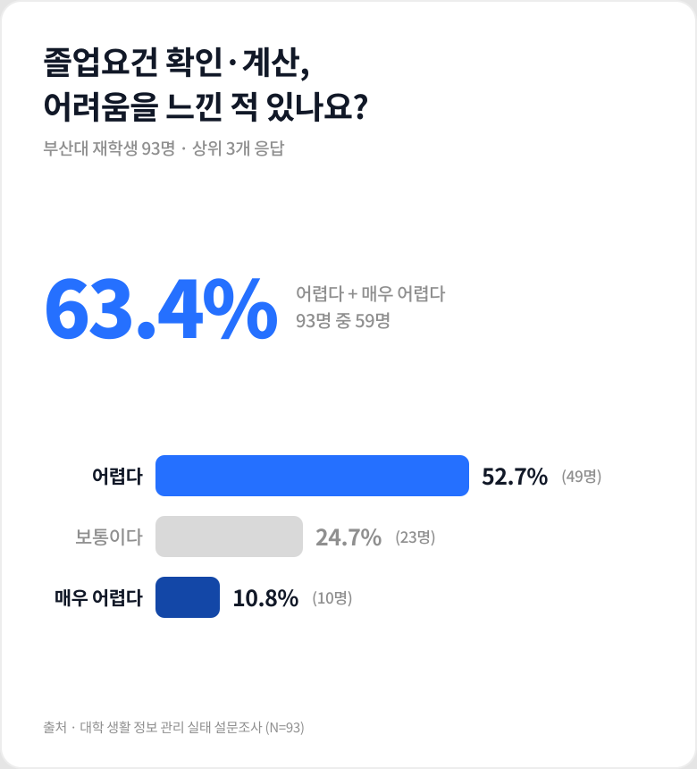
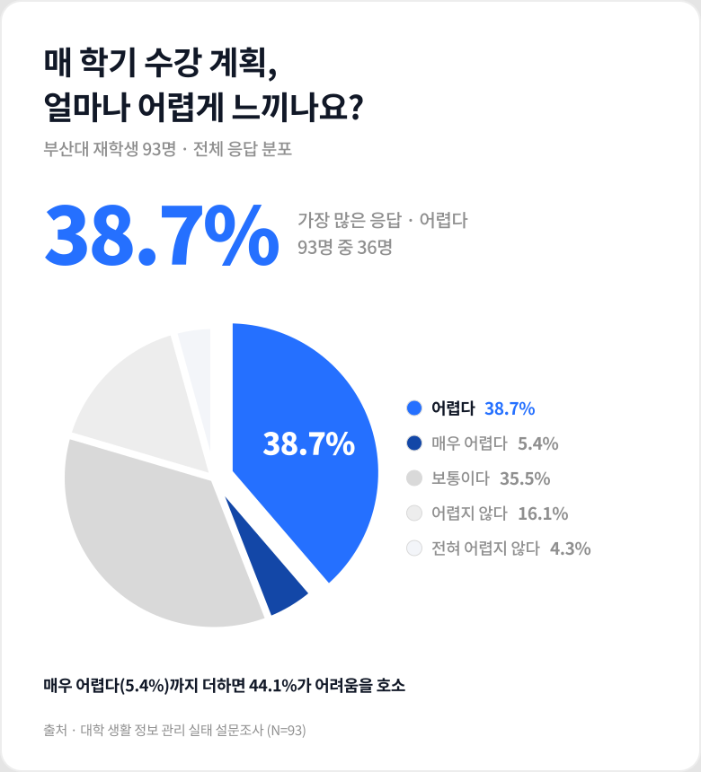
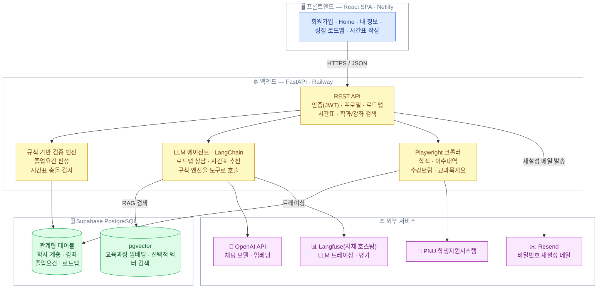
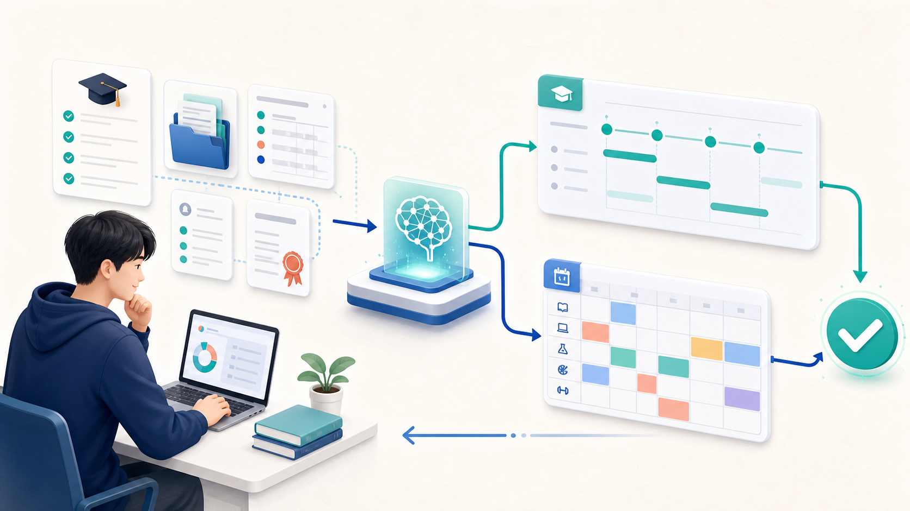
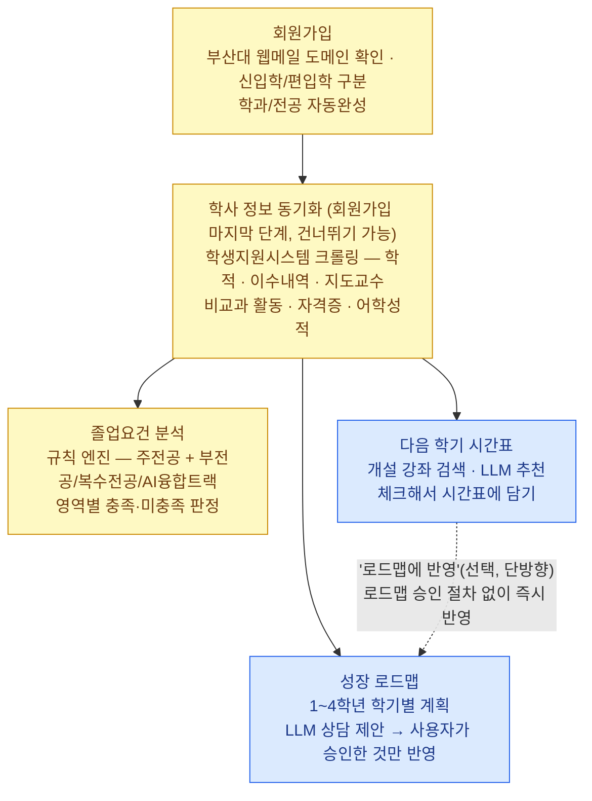
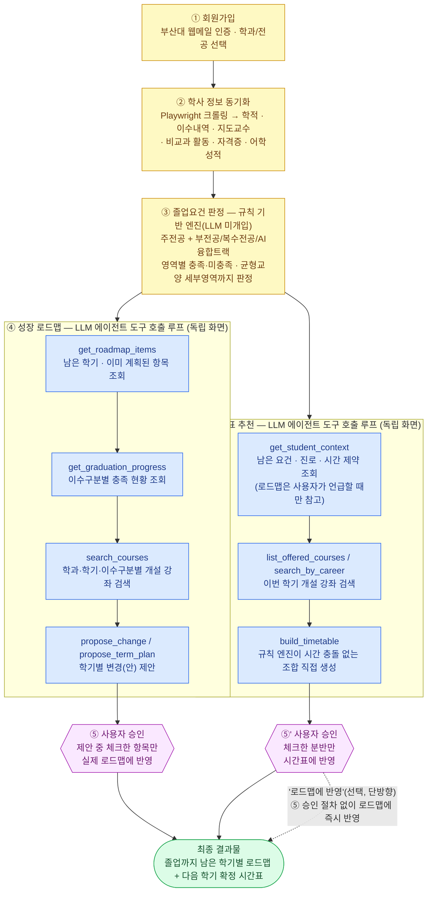

<div align="center">
  <h1>Plan-U</h1>
  <p>
    부산대학교 재학생의 졸업요건을 규칙 기반으로 분석하고<br/>
    1~4학년 성장 로드맵과 다음 학기 시간표 후보를 추천하는 학업 설계 지원 서비스
  </p>
  <p>
    <strong>배포된 서비스</strong>:
    <a href="https://planu-pnu.netlify.app">planu-pnu.netlify.app</a>
    · API 문서 <a href="https://pnuai-a-03-team-u-production.up.railway.app/docs">/docs</a>
  </p>

[](https://github.com/PNU-2026-AI-Hackathon/pnuai-a-03-team-u/actions/workflows/golden-eval-dry.yml)
[](https://github.com/PNU-2026-AI-Hackathon/pnuai-a-03-team-u/actions/workflows/security-scan.yml)

</div>

> **한눈에 보기** — 이수내역을 바탕으로 **① 졸업요건을 규칙 기반으로 판정**하고, **② 졸업까지의 학기별 로드맵**과 **③ 다음 학기의 시간 충돌 없는 시간표 후보**를 제안합니다. AI는 판정 결과를 바꾸지 않으며, AI 제안은 자동 저장되지 않고 사용자가 직접 확인·선택한 것만 반영됩니다.

| 규칙 기반 판정 | AI는 제안만 | 실제 개설 강좌 기반 |
|:---:|:---:|:---:|
| 졸업요건 충족·미충족을 결정론적으로 계산 | 로드맵·시간표 선택지를 설명하고 추천 | 수강편람의 분반·시간 정보를 바탕으로 후보 생성 |

## 목차

1. [프로젝트 소개](#1-프로젝트-소개)
2. [상세설계](#2-상세설계)
3. [개발결과](#3-개발결과)
4. [설치 및 사용 방법](#4-설치-및-사용-방법)
5. [소개 및 시연영상](#5-소개-및-시연영상)
6. [팀 소개](#6-팀-소개)
7. [해커톤 참여 후기](#7-해커톤-참여-후기)
8. [참고문헌 및 출처](#8-참고문헌-및-출처)

---

### 1. 프로젝트 소개
#### 1.1. 개발배경 및 필요성
본 프로젝트는 팀원의 실제 경험에서 출발했다. 졸업까지의 수강계획을 세우기 위해 학과 홈페이지의 졸업요건과 학생지원시스템의 이수내역을 각각 조회한 뒤 이를 대조해가며 계획을 별도 문서로 정리해야 했고, 이수내역이 학기마다 갱신되므로 같은 작업이 매 학기 수강신청 시기마다 반복되었다. 졸업요건을 한눈에 확인하고 졸업까지의 계획과 다음 학기 시간표를 한 화면에서 설계할 수 있다면 이 부담을 없앨 수 있다고 판단했다.

북미의 Stellic, Advisor.AI 등은 학생이 자신의 졸업요건 충족 현황을 직접 확인하고 학위 계획과 수강계획을 세우도록 지원하는 서비스를 제공하고 있다. 다만 이들은 대학이 계약해 도입해야 쓸 수 있는 형태이며, 국내에서 학생이 자신의 이수내역을 기준으로 졸업까지의 수강계획을 설계할 수 있는 도구는 아직 보편화되어 있지 않다.

부산대학교 역시 학생지원시스템, 학생역량지원시스템, 취업전략과 등 다양한 디지털 지원 체계를 운영하고 있다. 그러나 학생 관점에서는 학사 정보, 비교과 정보, 취업·프로그램, 자격증·어학 시험 정보가 여러 시스템과 외부 사이트에 분산되어 있어 필요한 정보를 한 번에 파악하기 어렵다. 이러한 어려움이 개인적 경험에 그치는지 확인하기 위해 부산대학교 재학생 93명을 대상으로 설문조사를 실시했다. 그 결과 졸업요건·이수학점·필수과목 확인·계산이 어렵다는 응답이 63.4%에 달했고, 매 학기 수강 계획을 세울 때 얼마나 어렵게 느끼는지 묻는 문항에서는 '어렵다'(38.7%)와 '매우 어렵다'(5.4%)를 합쳐 44.1%가 어려움을 호소했으며, '보통이다'(35.5%)까지 더하면 5명 중 4명이 수강 계획 수립을 쉽지 않은 일로 인식했다. 학사 정보를 찾는 일부터 학기 계획을 세우는 일까지, 학사 설계 전 과정이 학생에게 부담이라는 점이 확인된 것이다.

<p align="center">
  
  
</p>

부산대학교가 운영하는 산지니 AI는 범용 AI 활용 환경과 교내 정보 접근성 향상에 초점이 있을 뿐, 학생 개인의 이수 과목·성적·졸업요건·다중전공 여부 등을 구조화해 다음 학기 수강계획을 설계하는 서비스와는 목적이 다르다. 따라서 기존 시스템을 대체하기보다는, 학생이 흩어진 정보를 해석하고 자신의 졸업요건과 수강 목표에 맞게 실행 가능한 수강계획을 세울 수 있도록 돕는 별도의 개인화 의사결정 지원 서비스가 필요하다. 본 프로젝트는 이 가운데 가장 반복적이고 정확성이 중요한 '졸업요건 분석'과 '수강계획 추천 및 시간표 AI 추천'을 우선 과제로 삼는다.
<br/>

#### 1.2. 개발목표 및 주요내용
본 프로젝트의 목표는 부산대학교 재학생이 자신의 학업 정보를 입력하면, 주전공 및 부전공·복수전공 졸업요건을 분석하고 1학년부터 4학년까지의 성장 로드맵과 다음 학기 시간표 후보를 추천하는 학업 설계 지원 서비스 'Plan-U'를 구현하는 것이다. 초기 MVP에서는 외부 대외활동·채용 정보 연동보다, 학생의 학업 현황·졸업요건·수강 로드맵·시간표 추천에 필요한 핵심 기능을 우선 완성하는 데 집중한다.

핵심 기능 중심 구현 전략은 다음과 같다.
1. **학생 로그인**: 개인 계정으로 로그인하여 학업 정보와 추천 결과를 지속적으로 관리
2. **학생 정보 입력**: 회원가입·내 정보 수정 시 학생지원시스템 학번과 비밀번호를 입력하면 Playwright 크롤링으로 학적·이수내역을 자동 등록하고, 비교과·어학·자격증 등은 직접 입력
3. **주전공 + 부전공/복수전공 졸업요건 분석**: 전공필수·전공선택·교양·부족 학점·미이수 필수과목 자동 정리
4. **성장 로드맵**: 1~4학년 학기별 계획을 LLM과 함께 수립
5. **다음 학기 시간표 후보 추천**: 로드맵에서 도출된 추천 과목을 수강편람과 연결해 충돌 없는 시간표 후보 제시
<br/>

#### 1.3. 세부내용
졸업요건 충족 여부 판정은 생성형 AI가 아니라 **규칙 기반 검증 엔진**이 담당한다. 학과별 졸업요건과 학칙(총 이수학점, 영역별 최소 학점, 필수 이수과목, 선수과목, 재수강 규칙 등)을 구조화된 규칙 집합으로 정의하고, 학생의 이수내역과 결정론적으로 대조하여 영역별 충족/미충족을 판정한다. 복수전공·부전공의 경우 각 전공 규칙을 독립적으로 적용한 뒤 중복 인정 규칙을 반영해 통합 결과를 산출한다.

생성형 AI(LLM)는 이 검증 결과를 입력으로 받아 '설명'과 '추천'만 담당하며, 졸업요건 충족 판정 자체에는 관여하지 않는다. 즉 정확성·재현성이 요구되는 판정은 규칙 엔진이, 자연어 설명과 우선순위 제안 등 유연성이 필요한 부분은 LLM이 맡는 구조로 역할을 분리하여 추천의 유연성과 판정의 신뢰성을 동시에 확보한다. 학생지원시스템에서 수집한 학적·이수내역 등 민감한 개인정보를 다루는 만큼, 저장·전송·LLM 호출 전반의 보안·개인정보 원칙은 2.3절에 별도로 정리했다.

핵심 기능(본선 구현)은 졸업요건 분석(F-01), AI 수강 계획 추천(F-02), AI 기반 수강신청 시간표 추천(F-03)이며, 확장 기능(향후 개발)으로는 비교과·공모전 개인화 추천(F-04), 진로별 자격증·어학 준비 일정 추천(F-05), 통합 정보 캘린더(F-06), AI 기반 학사·진로 챗봇(F-07)을 계획하고 있다.
<br/>

#### 1.4. 기존 서비스(상품) 대비 차별성
본 서비스는 기존의 학사 행정 시스템, 학생역량 관리 시스템, 시간표 작성 서비스 등이 각각 분리하여 제공하던 기능을 하나의 학생 개인 맥락 안에서 통합한다는 점에서 차별성을 가진다.

1. **단순 정보 조회를 넘어 개인 맞춤형 실행계획을 제공**: 학생지원시스템·학생역량지원시스템은 행정 기능과 비교과·경력 관리에 특화되어 있을 뿐, 이수현황·졸업요건·다전공 여부·비교과·외부활동·희망 진로를 하나의 흐름으로 연결하지 못한다. 본 서비스는 이를 통합 프로필로 관리하고 실제 행동으로 이어지는 실행계획을 제안한다.
2. **산지니 AI·범용 AI의 한계를 구조화된 데이터와 검증 로직으로 보완**: 학생 개인 데이터를 LLM의 컨텍스트로 활용하고, 학사 정보 검색 및 졸업요건 검증 로직을 결합하여 학생별 상황에 맞는 학사·진로 상담을 제공한다.
3. **시간표 작성 도구를 졸업요건 기반 수강신청 지원으로 확장**: 에브리타임 시간표 마법사 등 기존 도구는 시간 충돌 여부만 판단하지만, 본 서비스는 졸업요건·다전공 이수계획·선수과목·재수강 여부까지 함께 분석해 실제 졸업과 장기 수강계획에 도움이 되는 시간표 후보를 추천한다.
4. **장기 로드맵을 실제 수강계획과 연결**: 1~4학년 학기별 성장 로드맵에서 도출된 추천 과목을 다음 학기 시간표 후보와 연결함으로써, 장기 계획에 그치지 않고 실제 수강신청에 활용 가능한 형태로 제공한다.

종합하면, 본 서비스의 차별성은 단순 정보 제공이 아니라 학생 개인 데이터에 기반한 실행 가능한 학업·진로 설계에 있다.
<br/>

#### 1.5. 사회적가치 도입 계획
본 서비스는 개인의 정보력 차이가 학업·진로 기회의 차이로 확대되는 것을 완화하는 데 목적을 둔다. 어떤 학생이든 자신의 이수 현황을 바탕으로 졸업까지의 학업 계획(성장 로드맵)과 다음 학기 시간표 추천을 받을 수 있게 하여, 특히 저학년·복수전공자·진로를 탐색 중인 학생에게 보다 균등한 학업·진로 준비 환경을 조성한다.

또한 흩어진 학업·진로 정보를 연결하여 학생지원시스템, 학생역량지원시스템, 취업전략과 등 기존 학생지원 인프라의 활용률을 높이고, 학교가 이미 제공하고 있는 상담·비교과·취업지원 자원에 대한 접근성도 함께 높인다.

장기적으로는 축적된 질문·탐색 데이터를 학생들이 자주 찾는 정보, 제때 찾지 못하는 공지, 오해가 빈번한 졸업요건 항목 등을 집계하는 형태로 분석하여 대학 행정의 안내 체계와 정보 구조 개편에 참고 자료로 제공할 수 있다. 나아가 PNU 특화 데이터 파이프라인과 모듈형 설계를 기반으로 타 대학에도 동일한 방식의 서비스를 이식할 수 있어, 장기적으로 다수 대학을 지원하는 학업 의사결정 플랫폼으로 발전시켜 더 넓은 학생 사회에 기여할 수 있다.
<br/>

<p align="right">(<a href="#목차">목차로 ↑</a>)</p>

### 2. 상세설계
#### 2.1. 시스템 구성도

<br/>

#### 2.2. 사용기술
| 구분 | 이름 | 버전 |
|:---:|:---|:---|
| 프론트엔드 | React | 19.2 |
| | Vite | 8.1 |
| | TypeScript | 6.0 |
| | react-router-dom | 7.18 |
| | axios | 1.18 |
| | lucide-react | 1.23 |
| | react-markdown (+ remark-gfm) | 10.1 |
| 백엔드 | Python | 3.12 |
| | FastAPI | 0.138 |
| | Uvicorn | 0.49 |
| | SQLAlchemy | 2.0 |
| | Alembic | 1.18 |
| | LangChain (+ langchain-openai) | 1.3 |
| | OpenAI SDK | 2.44 |
| | Langfuse (LLM 트레이싱, 자체 호스팅) | 4.14 |
| | slowapi | 0.1 |
| | bcrypt | 5.0 |
| | python-jose | 3.5 |
| 데이터베이스 | PostgreSQL (Supabase) | 17 |
| | pgvector | 0.8 |
| 크롤러 | Playwright | 1.61 |
| | BeautifulSoup | 4.15 |
| | APScheduler | 3.11 |
| 배포 | Netlify (프론트엔드) · Railway (백엔드) | - |

**기술 선정 및 역할**

| 기술 | 선정 이유 | 역할 |
|:---|:---|:---|
| React + TypeScript | 팀의 개발 경험이 있고, 화면과 API 데이터의 타입 오류를 미리 확인할 수 있다. | 화면 구성·상태 관리 |
| Vite | 빠른 개발 서버와 즉시 반영(HMR)으로 반복 개발에 적합하다. | 프론트엔드 빌드·개발 서버 |
| react-router-dom | 로그인 여부에 따라 화면 접근을 일관되게 제어할 수 있다. | 화면 이동·인증 가드 |
| axios | 인증 토큰과 오류 처리를 API 요청마다 공통으로 적용하기 쉽다. | 백엔드 API 통신 |
| react-markdown + remark-gfm | AI 답변의 목록·표를 안전하게 보여줄 수 있다. | AI 답변 마크다운 표시 |
| FastAPI | 요청 검증과 API 문서화가 내장돼 있고 비동기 작업에 적합하다. | REST API·요청 검증·API 문서 |
| SQLAlchemy + Alembic | 학사 데이터 구조와 변경 이력을 안정적으로 관리할 수 있다. | 데이터 모델·DB 마이그레이션 |
| LangChain + OpenAI SDK | AI 도구 호출을 체계화하고 임베딩을 직접 연동할 수 있다. | AI 상담·RAG 임베딩 |
| Langfuse | AI 응답 품질, 지연 시간, 비용을 한곳에서 점검할 수 있다. | AI 실행 기록·모니터링 |
| slowapi | 과도한 요청과 로그인 시도를 제한할 수 있다. | API 요청량 제한 |
| bcrypt / python-jose | 비밀번호 보호와 로그인 토큰 검증에 널리 쓰이는 방식이다. | 비밀번호 해시·JWT 인증 |
| PostgreSQL (Supabase) + pgvector | 학사 데이터와 검색용 임베딩을 하나의 DB에서 관리할 수 있다. | 데이터 저장·선택적 벡터 검색 |
| Playwright | 로그인 후 표시되는 학생지원시스템 정보를 읽을 수 있다. | 학사 정보·수강편람 수집 |
| BeautifulSoup | 수집한 페이지의 표 데이터를 가볍게 추출할 수 있다. | HTML 데이터 정리 |
| APScheduler | 별도 서버 없이 반복 작업을 예약할 수 있다. | 정기 수집·보존기간 파기 예약 |
<br/>

#### 2.3. 보안
본 서비스는 학적·이수내역, 자격증·어학 성적 등 민감한 학사 정보를 다룬다. 필요한 정보만 수집하고, 본인만 접근하며, 서비스가 AI에 구성해 보내는 정보에서는 직접 식별정보를 제외하는 것을 기본 원칙으로 한다.

| 단계 | 보호 원칙 | 적용 내용 |
|---|---|---|
| 수집 | 최소 수집·사전 동의 | 회원가입 시 개인정보 처리 동의를 받고, 서비스에 필요한 학사 정보만 수집한다. |
| 저장 | 자격증명 미보관 | 학생지원시스템 학번·비밀번호는 동기화할 때만 사용하고 저장하지 않는다. 서비스 비밀번호는 복원할 수 없는 해시 형태로 저장한다. |
| 전송 | 암호화 통신 | 서비스 전 구간을 HTTPS(TLS)로 보호한다. |
| 접근 | 본인 데이터만 조회 | 로그인 토큰(JWT)으로 다른 사용자의 학사 정보 접근을 제한한다. |
| 외부 AI·관측 | 식별정보 제외·마스킹 | 이름·학번·이메일은 AI 프롬프트에 넣지 않는다. AI 실행 기록은 학번·이메일·전화번호를 가리고 사용자 식별자는 해시로 바꾼다. |
| 보관·파기 | 탈퇴 즉시 삭제 | 탈퇴하면 계정과 학사 정보를 삭제한다. 24개월 이상 미접속 계정 파기는 백업·복구 검증 후 자동화할 예정이다. |
| 안내 | 처리 기준 공개 | `/privacy`에서 수집 항목, 이용 목적, 보유기간, 외부 처리 범위를 확인할 수 있다. |

**LLM 전달 정보 기준.** 서비스는 졸업요건과 수강계획을 설명하는 데 필요한 학사 정보만 AI에 전달하고, 이름·학번·이메일은 제외한다. 상세 근거는 [`docs/backend/features/llm-privacy-audit.md`](docs/backend/features/llm-privacy-audit.md)에서 확인할 수 있다.

| LLM 전달 정보 | LLM 제외 정보 |
|---|---|
| 학과·전공, 교육과정 연도 | 이름 |
| 진로 목표 | 학번 |
| 과목명·이수구분 등 이수 요약<br/>(성적 등급 제외) | 이메일 |
| 균형교양 영역별 이수 현황 | 학생지원시스템 비밀번호 |
| 남은 학점, 로드맵 항목, 강좌 검색 결과 | 사용자 내부 식별자(`user_id`) |

학과·과목·학점처럼 추천에 필요한 정보만 전달하며, 이름·학번·이메일 같은 직접 식별정보는 전달하지 않는다.

AI가 사용하는 기능은 요청한 학생의 데이터만 참조하며, AI가 다른 사용자의 식별자를 입력해 조회할 수 있는 경로를 두지 않는다.

관측 도구(Langfuse)에 남는 실행 기록에서는 아래 정보를 자동으로 가린다. 이 처리는 AI에 전달하는 내용이 아니라 기록 데이터에만 적용된다.

| 마스킹 항목 | 처리 방식 |
|---|---|
| 학번 | `<STUDENT_ID>`로 대체 |
| 이메일 | `<EMAIL>`로 대체 |
| 휴대전화·유선전화 | `<PHONE>`로 대체 |

사용자 내부 식별자도 원문 대신 해시값 일부만 기록한다.

**운영상 유의할 점**

- 채팅·진로 목표 등 자유 입력란의 주소·생년월일은 현재 마스킹 범위 밖일 수 있어, AI에 전달될 수 있다. 입력하지 않도록 안내한다.
- 탈퇴 시 서비스 DB는 삭제되지만, Langfuse에 남은 해시 식별자 기록은 별도 삭제 절차가 필요하다.
- 자체 운영하는 Langfuse의 접근 권한과 네트워크 보안은 팀이 지속적으로 관리한다.
<br/>

#### 2.4. 품질 검증
졸업요건 판정의 정확성과 AI 추천의 동작 품질을 분리해 검증한다. 판정은 규칙 엔진만 수행하고, LLM은 설명과 추천만 담당한다.

| 검증 구분 | 실행 방식 | 확인 항목 |
|---|---|---|
| 단위 테스트 | `pytest` | 도메인·API·크롤링·보안 등 700개 이상 테스트 |
| 규칙 엔진 골든테스트 | `run_golden_tests.py` | 졸업요건 판정 결과(TC01~TC11) |
| AI 구조 검증 | `tests.eval.run_eval` | 로드맵·시간표 에이전트의 도구 호출과 기본 동작 |
| LLM 응답 검증 | `tests.eval.run_eval --live` | 실제 응답의 과목·시간표·선수과목 조건 |
| 주간 품질 관측 | GitHub Actions, 케이스별 3회 반복 | 응답 품질·지연 시간·비용 추이 |

실제 LLM 평가는 Langfuse에 기록해 추이를 확인하며, LLM의 확률적 특성상 자동 머지 차단에는 사용하지 않는다. 상세한 평가 기준은 [`docs/ai-usage.md`](docs/ai-usage.md)에서 확인할 수 있다.

#### 2.5. CI/CD
PR을 열면 변경 범위에 맞는 자동 검사를 실행하고, 팀의 독립 리뷰를 거쳐 `main`에 반영한다. `main` 반영 후에는 Netlify와 Railway가 각각 자동 배포한다.

| 구분 | 실행 시점 | 확인 내용 |
|---|---|---|
| 보안 검사 | `main` push·모든 PR, 매주 월요일 | 시크릿 노출, Python 의존성 취약점 |
| AI 기능 검사 | 지정된 planning·academics·eval 경로 등 변경 시 | AI 도구 호출과 골든 테스트 dry-run |
| DB 검사 | 마이그레이션 변경 시 | 리비전 충돌·순환·다중 헤드 |
| 정기 AI 평가 | 매주 화요일, 수동 실행 가능 | 실제 LLM 응답 품질 추이 |

자동 검사는 결과를 공유하는 용도이며, 현재 필수 머지 차단 규칙으로 설정되어 있지 않다. 전체 단위 테스트와 졸업요건 골든 테스트는 PR 전 로컬에서 실행하고, 별도 세션의 독립 리뷰로 최종 확인한다.

| 배포 대상 | 배포 방식 |
|---|---|
| 프론트엔드 | `main` 반영 후 Netlify가 빌드·배포 |
| 백엔드 | `main` 반영 후 Railway가 빌드·배포 |

<br/>

<p align="right">(<a href="#목차">목차로 ↑</a>)</p>

### 3. 개발결과
#### 3.1. 전체시스템 흐름도
회원가입 직후 학사 정보 동기화까지는 온보딩 위저드가 순서대로 안내하지만(동기화는 건너뛰고 나중에 `내 정보`에서 해도 된다), 그다음 세 화면(졸업요건 분석·성장 로드맵·시간표 작성)은 **순서가 강제되지 않는 독립 화면**이다 — 로그인 후 아무 메뉴로나 바로 들어갈 수 있고, 동기화 전이면 각자 빈 상태 안내를 보여줄 뿐이다.

<p align="center">
  
</p>



로드맵과 시간표는 서로 몰라도 되는 별개의 AI 기능이다 — 로드맵 없이 시간표만 써도 되고 그 반대도 된다. 둘 사이의 유일한 데이터 연결은 시간표 화면의 "로드맵에 반영" 버튼으로("담기"는 검색한 강좌를 열려 있는 시간표 초안에 넣고 빼는 별개 동작이다), 확정한 분반을 로드맵 항목으로도 즉시 저장하는 사용자 선택 액션이지 로드맵 쪽 AI 제안·승인 절차(3.2 참고)를 거치지 않는다. 두 기능 모두 AI 추천은 **human-in-the-loop** 구조다 — LLM은 제안만 쌓고, 사용자가 체크해 승인한 항목만 실제 데이터에 반영된다.
<br/>

#### 3.2. 기능설명
> **서비스 체험**: [Plan-U 배포 서비스](https://planu-pnu.netlify.app)에서 회원가입, 졸업요건 분석, 성장 로드맵, 시간표 작성 흐름을 직접 확인할 수 있다. 화면 캡처는 개인정보가 포함될 수 있어, 비식별화한 시연 이미지·영상이 준비되는 대로 5절에 추가한다.

3.1이 화면 단위의 큰 흐름이라면, 아래는 그 흐름 안에서 **AI 에이전트가 실제로 어떤 도구를 몇 단계에 걸쳐 호출하는지**를 보여준다. Plan-U의 두 AI 기능(성장 로드맵 상담, 시간표 추천)은 LLM이 자유롭게 답을 지어내는 게 아니라, 정해진 도구(tool) 집합을 순서대로 호출하며 실제 DB 값을 확인한 뒤에만 답을 만든다 — 그리고 그 답은 하나도 자동으로 저장되지 않고, **사용자가 체크해서 승인한 것만** 반영된다. 두 에이전트는 **③에서 병렬로 갈라지는 독립 화면**이다 — 로드맵을 거치지 않고 바로 시간표 화면에서 AI 추천을 받아도 되고, 그 반대도 된다(3.1 참고).



**단계별 역할**
1. **회원가입** — 부산대 웹메일 인증과 학과·전공 자동완성으로 이후 모든 판정의 기준이 되는 학적 정보를 정확히 확정한다.
2. **학사 정보 동기화** — Playwright 크롤러가 학생지원시스템에서 학적·이수내역·지도교수뿐 아니라 비교과 활동·자격증·어학성적까지 한 번에 가져온다. 여기서 확보한 데이터가 ③ 이후 전 단계의 입력값이다.
3. **졸업요건 판정** — **여기까지는 AI가 관여하지 않는다.** 학과별로 구조화한 규칙(택N/M, 최소 학점, 영역별 세부기준)과 이수내역을 결정론적으로 대조해 충족/미충족을 가른다. 정확성이 생명인 판정이라 LLM에 맡기지 않는다는 게 이 프로젝트의 핵심 원칙이다.
4. **성장 로드맵** / **④' 시간표 추천** — ③이 확정한 남은 요건을 각자 독립적으로 입력받는 **서로 다른 화면**이다. 로드맵은 `get_roadmap_items`로 남은 학기를, `get_graduation_progress`로 그중 무엇이 부족한지 먼저 확인하고 `search_courses`로 실제 개설 근거가 있는 과목만 후보로 삼은 뒤에야 `propose_change`/`propose_term_plan`으로 변경안을 제안한다. 시간표는 `get_student_context`가 남은 요건·진로·시간 제약을 모으고(로드맵에 계획이 있어도 사용자가 언급할 때만 참고 — 필수 입력이 아니다) `list_offered_courses`/`search_by_career`가 이번 학기에 **실제로 열린** 강좌만 후보로 좁힌 뒤, 시간 충돌 없는 조합은 LLM이 아니라 규칙 엔진(`build_timetable`)이 직접 계산한다. 둘 다 과목명을 지어내는 경로 자체가 없다.
5. **사용자 승인** / **⑤' 사용자 승인** — 제안은 전부 임시 상태로 쌓인다. 사용자가 화면에서 체크한 것만 각자 실제 데이터(로드맵 항목 / 시간표 분반)로 확정된다 — AI가 실수해도 되돌릴 수 있는 구조다. 두 승인은 서로 독립이다: 시간표만 써도, 로드맵만 써도 완결된 기능이다. 유일한 예외가 시간표 화면의 "로드맵에 반영" 버튼 — 확정한 분반을 로드맵 항목으로도 즉시 저장하는 사용자 선택 액션으로, ⑤의 승인 절차를 거치지 않는 별도 경로다.

**결국 이 흐름 전체가 만드는 것**: ③의 규칙 기반 판정이 "지금 뭐가 부족한지"를 정확하게 확정하고, ④·④'의 AI 에이전트가 각자 그 부족분을 실제 개설 데이터 안에서만 채우는 방안을 독립적으로 찾아 제안하며, ⑤·⑤'의 승인 구조가 그 제안을 학생이 최종 결정하게 만든다. 세 축이 합쳐진 결과가 F-01(졸업요건 자동 분석)·F-02(AI 수강 계획 추천)·F-03(AI 시간표 추천)이고, 학생이 실제로 손에 쥐는 최종 산출물은 "졸업까지 학기별로 무엇을 들어야 하는지"와 "그중 다음 학기에 시간 충돌 없이 확정할 수 있는 시간표"라는, 매 학기 반복해서 학과 페이지와 학생지원시스템을 오가며 손으로 대조하던 작업을 대신한 답이다.
<br/>

##### 화면별 상세
##### ` 회원가입 / 로그인 `
- 부산대 웹메일(@pusan.ac.kr)로만 가입 — 부산대 구성원 확인
- 신입학/편입학 구분 선택 — 편입생은 로드맵이 "입학 전 인정 학점 + 3·4학년"으로 구성됨
- 학과·전공 자동완성 (부전공·복수전공 포함) — 정식 편제에 없는 이름이 저장되는 것을 차단
- 회원 탈퇴 — 계정과 학사 데이터를 즉시 파기
- 비밀번호 찾기 — 메일로 받은 1회용 재설정 링크(만료·재사용 방지 포함)로 재설정

##### ` Home `
- 학적 프로필 (학부·전공·학년·진로), 이수 학점 진행률
- 지도교수 상담 여부 · 자격증 및 어학 성적 · 활동 목록 3개 카드 요약

##### ` 내 정보 `
- 학생지원시스템 학번·비밀번호 입력 → Playwright 크롤링으로 수강 과목·성적 자동 등록 (자격증명은 저장하지 않음)
- 학기별 성적 (달력 학기 기준, 최신순 · 편입생은 입학 전 인정 학점 별도 표시)
- 졸업요건 영역별 충족 현황, 프로필·이수 내역 직접 수정
- AI융합트랙 등록·진도 확인

##### ` 성장 로드맵 `
- 학기별 / 요건별 / 학과 이수체계도 3개 탭
- 이미 이수한 과목과 앞으로의 계획을 하나의 타임라인으로 표시 (편입생은 3·4학년 슬롯만)
- 달력 학기와 커리큘럼 학기를 분리 관리 — 휴학·편입으로 둘이 어긋나도 학년 슬롯에 정확히 배치
- AI 상담 — 대화 스레드를 나눠 관리하고, AI가 제안한 변경안 중 체크한 것만 로드맵에 반영
- 균형교양 세부영역(사상과역사 등 7개)별 부족 영역을 짚어 추천

##### ` 시간표 작성 `
- 갈래(효원 균형·창의 교양 / 일반선택 / 효원핵심교양 / 전공) → 전공이면 단과대 → 학부 → 전공 순으로 개설 강좌 검색
- 전공 미선택 시 학부 공통 과목 기본 표시, 전공기초/전공필수/전공선택 칩으로 필터
- 시간표를 이름 붙인 문서로 저장·수정·삭제(CRUD), "로드맵에 반영" 버튼 한 번으로 로드맵에 즉시 반영
- 주간 시간표는 5분 단위 격자 — 부산대 75분 수업이 실제 시각(9:00~10:15)에 정확히 배치됨
- AI 추천 — 남은 요건·진로를 반영한 시간표 후보를 제안, 체크한 분반만 담김
- AI 대화는 세션 단위로 서버에 저장 — 새로고침해도 대화가 유지되고 스레드를 나눠 관리
<br/>

#### 3.3. 기능명세서
**핵심 기능 (구현 완료)**
|ID|기능명|구현 내용|
|:---:|:---|:---|
| F-01 | 졸업요건 자동 분석 | 이수 내역 크롤링 연동, 영역별 충족/미충족 판정, 복수전공·부전공·AI융합트랙 규칙(택N/M, 최소 학점 등) 동시 반영 |
| F-02 | AI 수강 계획 추천 | 이수 현황 기반 학기별 로드맵, LLM 상담으로 변경안 제안 → 사용자 승인 후 반영, 선수과목·학점 상한 검증 |
| F-03 | AI 시간표 추천 | 수강편람 기반 시간표 후보 생성, 시간 충돌 자동 검사, 개설 강좌 검색·담기, LLM 대화로 조건 반영 |

**운영·개인정보 보호 기능**
|ID|기능명|상태|내용|
|:---:|:---|:---:|:---|
| F-08 | 개인정보처리방침 · LLM 처리위탁 고지 | ✅ 배포 완료(2026-08-24, PR [#215](https://github.com/PNU-2026-AI-Hackathon/pnuai-a-03-team-u/pull/215)) | `/privacy`에 수집 항목·보유기간·파기 절차·OpenAI/Langfuse 위탁 범위를 명시하고, 회원가입 필수 동의 체크박스(서버 재검증 포함)로 연결 |
| F-09 | 보존기간 자동 파기 · 접근 감사 | 🟡 활성화 준비 | 장기 미접속 계정 파기 도구를 구현했다. 자동 파기는 백업·복구 리허설 후 활성화하며, 프로덕션 DB 접근 감사 로그 보존은 후속 운영 과제다. |

**확장 기능 (추후 개발)**
|ID|기능명|계획|
|:---:|:---|:---|
| F-04 | 비교과·공모전 개인화 추천 피드 | 전공·학년·희망 진로 기반 교내 프로그램 추천 (MVP 범위에서 제외, 화면·데이터 준비만 됨) |
| F-05 | 진로별 자격증·어학 준비 일정 추천 | 희망 직무별 시험 일정 안내 및 준비 타임라인 |
| F-06 | 통합 정보 캘린더 | 학사일정·자격증 접수일·비교과 신청 기간 통합, Google/Apple 캘린더 동기화 |
| F-07 | AI 학사·진로 챗봇 확장 | 현재 로드맵·시간표 상담에서 학사 공지·진로 상담 전반으로 확대 |
<br/>

#### 3.4. 디렉토리 구조
```
├── backend/
│   ├── app/
│   │   ├── api/                # REST 엔드포인트 (인증·프로필·로드맵·시간표·검색)
│   │   ├── core/               # 설정 · DB 연결 · 보안(JWT/bcrypt/Fernet) · 메일러 · Rate limit · 스케줄러(APScheduler)
│   │   ├── domains/
│   │   │   ├── academics/      # 학사 계층 · 졸업요건 · 규칙 판정 엔진
│   │   │   ├── courses/        # 과목 · 개설 강좌 · 교과목개요
│   │   │   ├── planning/       # 로드맵 · 시간표 · LLM 에이전트 (roadmap_chat / timetable_chat)
│   │   │   ├── content/        # 학사정보 안내 글 (API 미연결)
│   │   │   └── users/          # 사용자 · 편입 구분 · 활동/자격증
│   │   ├── ai/                 # RAG(pgvector 임베딩 · 교육과정 검색) · LLM 트레이싱/개인정보 마스킹(Langfuse)
│   │   └── ingestion/          # 학생지원시스템 크롤러
│   ├── migrations/             # Alembic 마이그레이션
│   ├── scripts/                # 시드 · 수강편람/교과목개요 적재 스크립트
│   └── tests/                  # 단위 테스트 (650+ 케이스)
├── frontend/
│   └── src/
│       ├── api/                # 백엔드 API 래퍼
│       ├── auth/               # 인증 컨텍스트
│       ├── components/         # 공용 컴포넌트 (레이아웃 · 자동완성 · 채팅 렌더링 등)
│       ├── data/                # 정적 데이터 (추천 활동 목록 · 로컬 스토리지 유틸)
│       ├── pages/              # 화면 (Auth · Dashboard · Info · Roadmap · Timetable)
│       └── routes/             # 라우터
├── infra/                      # 로컬 Postgres(pgvector) docker-compose, 배포 인프라 스캐폴딩
├── .github/                    # CI 워크플로우 (골든테스트 · 보안 스캔 · 마이그레이션 그래프)
└── docs/                       # 개발계획서 · 아키텍처 문서
```
<br/>

<p align="right">(<a href="#목차">목차로 ↑</a>)</p>

### 4. 설치 및 사용 방법
**배포된 서비스**: 프론트엔드 [planu-pnu.netlify.app](https://planu-pnu.netlify.app) · 백엔드 API [pnuai-a-03-team-u-production.up.railway.app](https://pnuai-a-03-team-u-production.up.railway.app)(`/docs`에 Swagger UI). 아래는 로컬 개발 환경 구성 방법이다.

**필요 환경**: Python 3.12+, Node.js 20+, PostgreSQL (pgvector 확장)

**백엔드**
```bash
$ cd backend
$ python3 -m venv .venv && source .venv/bin/activate
$ pip install -r requirements.txt
$ cp .env.example .env            # DATABASE_URL, OPENAI_API_KEY, JWT_SECRET_KEY 등 입력
$ alembic upgrade head            # DB 스키마 생성
$ python -m scripts.seed_school_hierarchy_full   # 단과대·학과·전공 전체 시드 (121개 학과, 재실행 안전)
$ uvicorn app.main:app --reload --port 8000
```

**프론트엔드**
```bash
$ cd frontend
$ npm install
$ npm run dev                     # http://localhost:5173
```

<details>
<summary>주요 환경 변수 (<code>backend/.env</code>)</summary>

| 변수 | 설명 |
|:---|:---|
| `DATABASE_URL` | PostgreSQL 연결 문자열 (pgvector 확장 필요) |
| `OPENAI_API_KEY` | LLM 에이전트 · RAG 임베딩용 |
| `JWT_SECRET_KEY` | 로그인 토큰 서명 키 |
| `CREDENTIAL_ENCRYPTION_KEY` | 레거시 포털 자격증명 암호화(Fernet) 키 (현재 동기화 경로는 저장하지 않음) |
| `SMTP_*` / `RESEND_API` | 비밀번호 재설정 메일 발송용 (미설정 시 발송을 건너뛰고 개발환경에서만 로그로 링크 확인) |
| `PNU_LOGIN_ID` / `PNU_LOGIN_PW` | 수강편람·교과목개요 적재 스크립트용 포털 계정 (선택) |

</details>
<br/>

### 5. 소개 및 시연영상
> 🎬 **추후 추가 예정** — 시연 영상 촬영 후 링크를 게시합니다.
<br/>

<p align="right">(<a href="#목차">목차로 ↑</a>)</p>

### 6. 팀 소개
| 이도원 | 조현우 | 안선주 | 한고은 | 이민석 |
|:-------:|:-------:|:-------:|:-------:|:-------:|
| ldwlee03@gmail.com | blackest21@gmail.com | pusanju83@pusan.ac.kr | hge7317@naver.com | leems060811@gmail.com |
| 백엔드 · PM · 팀장 | 백엔드 · AI 기능 구현 | UI/UX 디자인 | 프론트엔드 · 기획 | 프론트엔드 · 데이터분석 |
<br/>

<p align="right">(<a href="#목차">목차로 ↑</a>)</p>

### 7. 해커톤 참여 후기
> ✍️ 조현우 후기는 실제로 작성 완료. `[임시]` 표시가 붙은 나머지는 git 이력을 참고해 만든 초안이니, 그대로 제출하지 말고 각자 본인 목소리로 바꿔서 채울 것.

**AI 도구가 없었으면 못 냈을 성과** — 5인이 저장소 생성일(2026-05-21)부터 이 세션 기준 약 3개월 동안 PR 230개를 병합하고, 백엔드 단위테스트 656개·마이그레이션 48개를 쌓았다. Claude Code/Cursor/Codex를 팀 공동 경비로 구독해 누구든 막히면 바로 AI 에이전트를 켤 수 있게 했고, 크롤러 재실행이나 카탈로그 데이터 정합성 보정처럼 시간이 많이 드는 반복 작업을 AI에 맡긴 덕에 사람은 판단이 필요한 부분(설계 결정, 리뷰, 기획)에 더 집중할 수 있었다. 다만 "AI가 짰다"가 "맞다"를 보장하진 않아서, 그 검증 절차(독립 리뷰·골든테스트·실계정 확인)에 실제로 시간을 많이 썼다는 게 아래 개별 후기에도 반복해서 나온다 — 자세한 수치·방식은 [`docs/ai-usage.md`](docs/ai-usage.md) 참고.

- **이도원**
  > [임시] PM으로 있으면서 진짜 시간을 많이 쓴 건 새 기능이 아니라 화면에 안 보이는 곳이었다 — Railway/Netlify 배포 설정, CORS, alembic 브랜치가 갈라져 다중 head가 생긴 걸 두 번이나 병합한 것까지. 4명이 동시에 스키마를 건드리면 이런 충돌이 반복된다는 걸 겪고 나서야, "지금 마이그레이션 만들고 있다"고 팀 채팅에 미리 알리는 습관이 생겼다.
  >
  > AI 로드맵 상담 에이전트를 처음 붙였을 때는 사흘도 안 돼 신뢰성 문제가 연달아 터졌다. 검증 없이 텍스트로만 그럴듯하게 답하거나, 요청 범위를 벗어나 제안을 남발하거나, 로드맵 항목을 지우면 FK 위반으로 죽는 식이었다. "일단 LLM이 답하게 만드는 것"과 "그 답을 믿을 수 있게 만드는 것" 사이의 거리가 이렇게 클 줄 몰랐다. 사용자가 체크해서 승인한 것만 반영하는 구조로 정리하고 나서야 마음이 놓였다.
  >
  > 가장 무거웠던 건 팀원이 만든 졸업요건 스키마를 통째로 되돌리기로 한 결정이었다. 이미 여러 PR이 그 위에 쌓여 있었는데, 골든테스트를 통과시키려 할수록 설계가 복잡해지기만 했다. 만든 사람에게 "이거 되돌리자"고 꺼내는 게 제일 어려운 부분이었다 — 팀원과 상의를 거쳐 결정했지만, 누군가의 작업을 통째로 지우자고 말하는 순간은 몇 번을 해도 편해지지 않았다. 더 늦게 되돌릴수록 그 대화도 더 어려워진다는 걸 그때 배웠다.

- **조현우**
  > README에는 몇 주째 "배포 예정"이라고 적혀 있었다. 나도 별 의심 없이 그 문구를 믿고 작업을 짰는데(Langfuse를 로컬 전용이라고 전제하고 옮기던 중이었다), 팀원이 무심코 던진 질문 하나에 발각됐다 — "백엔드 서버가 없는데 프론트는 어떻게 돌아가?" 실제 배포 주소에 들어가보니 이미 몇 주 전부터 실사용자 트래픽을 받고 있었다. 문서는 검증하지 않으면 그 자체가 거짓말이 된다는 걸, 남이 아니라 내가 직접 속아본 뒤에야 체감했다.
  >
  > 그로부터 얼마 안 지나 진짜 배포 사고가 났다. "마이그레이션 먼저 적용 후 머지"라고 PR 본문에 적어두고 보류시켜둔 PR을, 팀원이 후속 문서 PR을 리뷰하다 같이 눌러버렸다. 배포본 회원가입이 그대로 500으로 깨졌다. alembic 리비전을 손으로 맞추고 재실행해서 복구는 됐지만, "사람이 PR 설명을 잘 읽으면 된다"는 안전장치가 얼마나 쉽게 뚫리는지 알게 됐다. 그 뒤로는 되돌리기 어려운 작업일수록 팀이 도입한 '머지 전 독립 리뷰'에 기대는 습관이 붙었다 — 실제로 내가 짠 로드맵 로직의 상태값 버그도 그 리뷰가 잡아준 적 있다.
  >
  > 가장 기억에 남는 건 한고은이 시간표에 담은 과목 두 개가 그리드에 안 뜬다고 물어봐서 같이 파고든 순간이다. DB를 뒤져보니 다음 학기 개설강좌의 66%가 시간 정보 없이 들어가 있었다 — 개강 5주 전, 학교가 아직 시간표를 확정하지도 않은 시점에 긁어놓고 그 뒤로 한 번도 다시 안 긁은 게 원인이었다. 재크롤링 한 번으로 34%에서 80%까지 올라갔다. 혼자 코드만 봤으면 절대 못 잡았을 문제를, 실제로 써보던 팀원이 먼저 짚어준 덕분에 찾았다 — 결국 제일 크게 배운 건 "누가 실제로 써보고 있는가"였다.

- **안선주**
  > [임시] 나는 git 커밋이 안 남는 역할이라 이 초안은 다른 팀원 커밋에 남은 흔적으로 대신 채웠다 — 진짜 후기는 내가 써야 한다. 그런데 그 흔적만 봐도 놀란 게, Figma 시안이 실제 화면에 반영된 게 한 번이 아니라 세 번이었다. 처음 시안을 넘긴 뒤에도 디자인 토큰이 실제 컴포넌트와 안 맞아 다시 맞추고, 6개 화면 구조를 통째로 다시 정합하는 라운드까지 있었다. "시안을 넘긴다"는 게 한 번의 전달이 아니라, 개발자가 실제로 만든 화면을 보면서 몇 번이고 다시 맞춰가는 과정이라는 걸 이번에 알았다.
  >
  > 학사 정보처럼 담을 게 많은 화면에서 제일 어려웠던 건 예쁜 배치가 아니라 "이 정보가 지금 이 학생에게 왜 필요한지" 우선순위를 정하는 일이었다. 시간표 카드 간격처럼 사소해 보이는 디테일도 "정보를 더 보여줄지"와 "지금 스프린트 안에 만들 수 있는 선에서 타협할지" 사이를 프론트 팀원과 계속 조율해야 했다.
  >
  > 개발자가 아니다 보니 "이게 지금 만들 수 있는 구조인지" 혼자 판단하기 어려운 순간이 많았다. 시안만 던지고 끝내지 않고 실제로 구현된 화면을 붙여보면서 계속 대화해야 간극이 좁혀진다는 걸 배웠다.
  >
  > (실제 후기: 팀과 소통하면서 겪었던 구체적인 순간, 기억에 남는 피드백을 이 자리에 직접 채워 넣을 것)

- **한고은**
  > [임시] 시간표 화면 하나를 붙잡고 정말 여러 번 고쳤다. 카드 간격 하나, 아이콘 툴팁 하나가 사용성을 이렇게 크게 가르는 줄은 만들기 전엔 몰랐다. Figma 시안을 반영하는 과정에서는 안선주가 넘긴 시안과 실제 컴포넌트가 계속 안 맞아서, "예쁜 화면"과 "지금 스프린트 안에 만들 수 있는 화면" 사이에서 매번 같이 타협점을 찾아야 했다.
  >
  > 반응형을 다듬으면서는 내 노트북 화면 크기만으로는 절대 다 못 잡는 버그가 많다는 것도 알게 됐다. 화면 하나가 늘어날 때마다 처음부터 여러 해상도를 같이 확인하는 습관이 붙었다.
  >
  > 가장 기억에 남는 건 관리회계·AI비즈니스 두 과목을 직접 시간표에 담아서 써보다가 주간 그리드에 하나도 안 뜨는 걸 발견한 순간이다. 조현우한테 물어봐서 같이 DB를 파봤더니, 2026-2학기 개설강좌의 66%가 시간 정보 없이 들어가 있었다 — 개강 5주 전이라 학교가 아직 시간표를 확정하지도 않은 시점에 크롤링해놓고 그 뒤로 안 긁은 게 원인이었다(자세한 내용은 `docs/CHANGELOG.md` 참고). 재크롤링 한 번으로 34%에서 80%까지 올라갔다. 화면만 들여다보고 있었으면 절대 못 잡았을 문제였다 — 실제로 써보는 것 자체가 QA라는 걸 이번에 제대로 느꼈다.

- **이민석**
  > [임시] 로그인 식별자 하나를 두고 팀이 세 번이나 정책을 뒤집었다 — 이메일이었다가, 학번이었다가, 다시 이메일로 돌아갔다가, 결국 내가 마지막으로 다시 학번으로 바꾸는 PR을 냈다. 이미 두 번 바뀐 걸 또 바꾸면서, 이런 정책은 코드부터 짜지 말고 팀 전체가 한자리에서 한 번에 결정했어야 했다는 걸 뼈저리게 느꼈다.
  >
  > 회원가입 온보딩, 로그인·홈 화면, 로드맵 직접 편집처럼 사용자가 서비스에 처음 들어오는 경로를 주로 맡았다. 백엔드 API 스펙이 중간에 바뀔 때마다 프론트를 다시 맞추는 일이 잦아서 처음엔 답답했는데, 나중엔 화면을 먼저 그리기보다 백엔드 팀원한테 스펙부터 물어보고 시작하는 쪽으로 순서를 바꿨다.
  >
  > 막바지엔 상단 도움말 메뉴처럼 작은 기능도 붙였다. 큰 화면 하나보다 이런 사소한 편의 기능이 실제 사용성 평가에서 의외로 눈에 띈다는 걸 느꼈다.
<br/>

<p align="right">(<a href="#목차">목차로 ↑</a>)</p>

### 8. 참고문헌 및 출처

**기술 문서**
- [FastAPI Documentation](https://fastapi.tiangolo.com/) - REST API, 의존성 주입, 자동 문서화(OpenAPI)
- [SQLAlchemy Documentation](https://docs.sqlalchemy.org/) / [Alembic](https://alembic.sqlalchemy.org/) - ORM, 마이그레이션
- [LangChain Documentation](https://python.langchain.com/) - LLM 에이전트 도구 호출 루프
- [pgvector](https://github.com/pgvector/pgvector) - PostgreSQL 벡터 유사도 검색(RAG)
- [Playwright Documentation](https://playwright.dev/python/) - 학생지원시스템(One-Stop) 크롤링
- [React](https://react.dev) / [Vite](https://vitejs.dev) - 프론트엔드 렌더링·빌드
- [Langfuse Documentation](https://langfuse.com/docs) - LLM 트레이싱·평가(자체 호스팅)

**저장소 문서**
- [아키텍처 개요](docs/backend/architecture.md)
- [개인정보·보안 계획](docs/backend/security-privacy-plan.md)
- [AI 활용 내역](docs/ai-usage.md) - 활용한 AI 도구·선정 이유, AI 생성 코드 검증 방식(LLM 개인정보 보안 경계는 1.3절 · [`llm-privacy-audit.md`](docs/backend/features/llm-privacy-audit.md) 참고)
- [기능별 설계 문서](docs/backend/features/) - 학사 인증, 로드맵 RAG, 시간표 채팅, 편입 학점 인정 등
- [프론트엔드 API 연동 가이드](docs/frontend/frontend-api-guide.md)
- [개발 변경 이력](docs/CHANGELOG.md)

**브랜드·글꼴 자산**
- Pretendard Variable - [orioncactus/pretendard](https://github.com/orioncactus/pretendard), SIL Open Font License 1.1
<br/>
