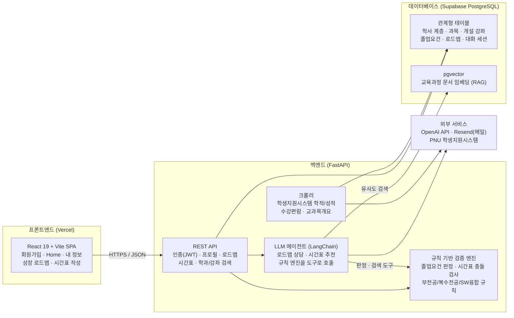

### 1. 프로젝트 소개
#### 1.1. 개발배경 및 필요성
최근 고등교육 환경에서는 학생 개인의 학사 데이터와 AI를 결합해 필요한 학업·진로 행동을 선제적으로 제안하는 '학생 성공(Student Success)' 패러다임이 확산되고 있다. 북미의 Stellic, Advisor.AI, Civitas Learning 등은 수강계획·졸업요건·진로 데이터를 통합해 학생 맞춤형 학사 지원을 제공하고 있으며, 국내 대학들도 교과·비교과·진로 데이터를 연계한 AI 기반 맞춤형 추천 시스템을 고도화하고 있다.

부산대학교 역시 학생지원시스템, 학생역량지원시스템, 취업전략과 등 다양한 디지털 지원 체계를 운영하고 있다. 그러나 학생 관점에서는 학사 정보, 비교과 정보, 취업·프로그램, 자격증·어학 시험 정보가 여러 시스템과 외부 사이트에 분산되어 있어 필요한 정보를 한 번에 파악하기 어렵다. 실제 설문조사(N=93)에서도 졸업요건·이수학점·필수과목 확인·계산이 어렵다는 응답이 63.4%, 비교과·튜터링·캡스톤·특강 등 정보를 제때 알지 못해 기회를 놓친 경험이 있다는 응답이 71.0%로 나타나 정보 분산 문제가 확인되었다.

부산대학교가 운영하는 산지니 AI는 범용 AI 활용 환경과 교내 정보 접근성 향상에 초점이 있을 뿐, 학생 개인의 이수 과목·성적·졸업요건·다중전공 여부 등을 구조화해 다음 학기 수강계획을 설계하는 서비스와는 목적이 다르다. 따라서 기존 시스템을 대체하기보다는, 학생이 흩어진 정보를 해석하고 자신의 졸업요건과 수강 목표에 맞게 실행 가능한 수강계획을 세울 수 있도록 돕는 별도의 개인화 의사결정 지원 서비스가 필요하다. 본 프로젝트는 이 가운데 가장 반복적이고 정확성이 중요한 '졸업요건 분석'과 '수강계획 추천'을 우선 과제로 삼는다.
<br/>

#### 1.2. 개발목표 및 주요내용
본 프로젝트의 목표는 부산대학교 재학생이 자신의 학업 정보를 입력하면, 주전공 및 부전공·복수전공 졸업요건을 분석하고 1학년부터 4학년까지의 성장 로드맵과 다음 학기 시간표 후보를 추천하는 학업 설계 지원 서비스 'Plan-U'를 구현하는 것이다. 초기 MVP에서는 외부 대외활동·채용 정보 연동보다, 학생의 학업 현황·졸업요건·수강 로드맵·시간표 추천에 필요한 핵심 기능을 우선 완성하는 데 집중한다.

핵심 기능 중심 구현 전략은 다음과 같다.
1. **학생 로그인**: 개인 계정으로 로그인하여 학업 정보와 추천 결과를 지속적으로 관리
2. **학생 정보 입력**: 성적표 이미지를 OCR/AI로 자동 등록하고, 비교과·어학·자격증 등은 직접 입력
3. **주전공 + 부전공/복수전공 졸업요건 분석**: 전공필수·전공선택·교양·부족 학점·미이수 필수과목 자동 정리
4. **성장 로드맵**: 1~4학년 학기별 계획을 LLM과 함께 수립
5. **다음 학기 시간표 후보 추천**: 로드맵에서 도출된 추천 과목을 수강편람과 연결해 충돌 없는 시간표 후보 제시
<br/>

#### 1.3. 세부내용
졸업요건 충족 여부 판정은 생성형 AI가 아니라 **규칙 기반 검증 엔진**이 담당한다. 학과별 졸업요건과 학칙(총 이수학점, 영역별 최소 학점, 필수 이수과목, 선수과목, 재수강 규칙 등)을 구조화된 규칙 집합으로 정의하고, 학생의 이수내역과 결정론적으로 대조하여 영역별 충족/미충족을 판정한다. 복수전공·부전공의 경우 각 전공 규칙을 독립적으로 적용한 뒤 중복 인정 규칙을 반영해 통합 결과를 산출한다.

생성형 AI(LLM)는 이 검증 결과를 입력으로 받아 '설명'과 '추천'만 담당하며, 졸업요건 충족 판정 자체에는 관여하지 않는다. 즉 정확성·재현성이 요구되는 판정은 규칙 엔진이, 자연어 설명과 우선순위 제안 등 유연성이 필요한 부분은 LLM이 맡는 구조로 역할을 분리하여 추천의 유연성과 판정의 신뢰성을 동시에 확보한다.

본 서비스는 성적표 이미지, 이수내역, 자격증·어학 성적 등 민감한 학사 개인정보를 다루므로 다음 원칙을 적용한다.
- 수집 최소화 및 동의: 서비스 제공에 필요한 항목만 수집하고 사전 동의를 받는다.
- 저장·전송 보안: 전송 구간은 HTTPS(TLS)로 보호하고, 저장 데이터는 AWS RDS에서 암호화하여 관리하며 비밀번호는 단방향 해시로 저장한다.
- OCR 원본 처리: 성적표 이미지는 텍스트 추출 직후 즉시 폐기하고 원본은 서버에 저장하지 않는다.
- 접근 통제: 계정 인증을 통해 본인 데이터에만 접근하도록 제한한다.
- 보관·파기: 회원 탈퇴 또는 보관기간 경과 시 개인정보를 지체 없이 파기한다.
- 외부 LLM 호출 시 비식별화: 외부 API(GPT/Claude) 호출 시 개인 식별정보를 직접 전송하지 않고 필요한 최소 정보만 비식별화하여 전달한다.

핵심 기능(본선 구현)은 졸업요건 분석(F-01), AI 수강 계획 추천(F-02), AI 기반 수강신청 시간표 추천(F-03)이며, 확장 기능(향후 개발)으로는 비교과·공모전 개인화 추천(F-04), 진로별 자격증·어학 준비 일정 추천(F-05), 통합 정보 캘린더(F-06), AI 기반 학사·진로 챗봇(F-07)을 계획하고 있다.
<br/>

#### 1.4. 기존 서비스(상품) 대비 차별성
본 서비스는 기존의 학사 행정 시스템, 학생역량 관리 시스템, 교내 AI 서비스, 범용 AI 도구, 시간표 작성 서비스가 각각 분리하여 제공하던 기능을 하나의 학생 개인 맥락 안에서 통합한다는 점에서 차별성을 가진다.

1. **단순 정보 조회를 넘어 개인 맞춤형 실행계획을 제공**: 학생지원시스템·학생역량지원시스템은 행정 기능과 비교과·경력 관리에 특화되어 있을 뿐, 이수현황·졸업요건·다전공 여부·비교과·외부활동·희망 진로를 하나의 흐름으로 연결하지 못한다. 본 서비스는 이를 통합 프로필로 관리하고 실제 행동으로 이어지는 실행계획을 제안한다.
2. **산지니 AI·범용 AI의 한계를 구조화된 데이터와 검증 로직으로 보완**: 학생 개인 데이터를 LLM의 컨텍스트로 활용하고, 학사 정보 검색 및 졸업요건 검증 로직을 결합하여 학생별 상황에 맞는 학사·진로 상담을 제공한다.
3. **시간표 작성 도구를 졸업요건 기반 수강신청 지원으로 확장**: 에브리타임 시간표 마법사 등 기존 도구는 시간 충돌 여부만 판단하지만, 본 서비스는 졸업요건·다전공 이수계획·선수과목·재수강 여부까지 함께 분석해 실제 졸업과 장기 수강계획에 도움이 되는 시간표 후보를 추천한다.
4. **장기 로드맵을 실제 수강계획과 연결**: 1~4학년 학기별 성장 로드맵에서 도출된 추천 과목을 다음 학기 시간표 후보와 연결함으로써, 장기 계획에 그치지 않고 실제 수강신청에 활용 가능한 형태로 제공한다.

종합하면, 본 서비스의 차별성은 단순 정보 제공이 아니라 학생 개인 데이터에 기반한 실행 가능한 학업·진로 설계에 있다.
<br/>

#### 1.5. 사회적가치 도입 계획
본 서비스는 개인의 정보력 차이가 학업·진로 기회의 차이로 확대되는 것을 완화하는 데 목적을 둔다. 특히 저학년, 복수전공자, 진로를 탐색 중인 학생, 외부활동 정보 탐색 경험이 적은 학생에게 개인화된 계획 수립 도구를 제공함으로써 보다 균등한 학업·진로 준비 환경을 조성한다.

또한 흩어진 학업·진로 정보를 연결하여 학생지원시스템, 학생역량지원시스템, 취업전략과 등 기존 학생지원 인프라의 활용률을 높이고, 학교가 이미 제공하고 있는 상담·비교과·취업지원 자원에 대한 접근성도 함께 높인다.

장기적으로는 축적된 질문·탐색 데이터를 학생들이 자주 찾는 정보, 제때 찾지 못하는 공지, 오해가 빈번한 졸업요건 항목 등을 집계하는 형태로 분석하여 대학 행정의 안내 체계와 정보 구조 개편에 참고 자료로 제공할 수 있다. 나아가 PNU 특화 데이터 파이프라인과 모듈형 설계를 기반으로 타 대학에도 동일한 방식의 서비스를 이식할 수 있어, 장기적으로 다수 대학을 지원하는 학업 의사결정 플랫폼으로 발전시켜 더 넓은 학생 사회에 기여할 수 있다.
<br/>

### 2. 상세설계
#### 2.1. 시스템 구성도


졸업요건 충족 판정과 시간표 충돌 검사는 **규칙 엔진이 결정론적으로** 수행하고, LLM은 그 결과를 도구 호출로 받아 설명·추천만 담당한다. LLM이 직접 시간표를 만들지 않으므로 시간이 겹치는 시간표가 사용자에게 노출되지 않는다.
<br/>

#### 2.2. 사용기술
| 구분 | 이름 | 버전 |
|:---:|:---|:---|
| 프론트엔드 | React | 19.2 |
| | Vite | 8.1 |
| | TypeScript | 6.0 |
| | react-router-dom | 7.18 |
| | axios | 1.18 |
| 백엔드 | Python | 3.12 |
| | FastAPI + Uvicorn | 최신 |
| | SQLAlchemy + Alembic | 2.x |
| | LangChain (+ langchain-openai) | 최신 |
| | bcrypt / python-jose / cryptography(Fernet) | 최신 |
| 데이터베이스 | PostgreSQL (Supabase) + pgvector | 15 |
| 크롤러 | requests + BeautifulSoup + APScheduler | 최신 |
| 배포 | Vercel (프론트엔드) | - |
<br/>

### 3. 개발결과
#### 3.1. 전체시스템 흐름도
```
회원가입 (부산대 웹메일 · 신입학/편입학 구분 · 학과/전공 자동완성)
   │
   ▼
학사 정보 동기화 (학생지원시스템 크롤링: 학적 · 이수내역 · 지도교수)
   │
   ▼
졸업요건 분석 (규칙 엔진: 주전공 + 부전공/복수전공/SW융합, 영역별 충족 판정)
   │
   ▼
성장 로드맵 (1~4학년 학기별 계획 · LLM 상담으로 변경안 제안 → 사용자가 승인한 것만 반영)
   │
   ▼
다음 학기 시간표 (개설 강좌 검색 → 담기 · LLM 추천 → 체크해서 시간표에 담기)
```

로드맵과 시간표의 AI 추천은 모두 **human-in-the-loop** 구조다. LLM은 제안만 쌓고, 사용자가 체크해 승인한 항목만 실제 데이터에 반영된다.
<br/>

#### 3.2. 기능설명
> 📸 화면별 스크린샷은 추후 추가 예정.

##### ` 회원가입 / 로그인 `
- 부산대 웹메일(@pusan.ac.kr)로만 가입 — 부산대 구성원 확인
- 신입학/편입학 구분 선택 — 편입생은 로드맵이 "입학 전 인정 학점 + 3·4학년"으로 구성됨
- 학과·전공 자동완성 (부전공·복수전공 포함) — 정식 편제에 없는 이름이 저장되는 것을 차단
- 비밀번호 찾기 — 웹메일 + 이름 확인 후 메일 링크로 재설정 (1회용 토큰, sha256 해시만 저장)

##### ` Home `
- 학적 프로필 (학부·전공·학년·진로), 이수 학점 진행률, 학기별 이수 현황
- 지도교수 상담 여부 확인, 자격증·비교과 활동 요약

##### ` 내 정보 `
- 학생지원시스템 크롤링으로 수강 과목·성적 자동 등록
- 학기별 성적 (달력 학기 기준, 최신순 · 편입생은 입학 전 인정 학점 별도 표시)
- 졸업요건 영역별 충족 현황, 프로필·이수 내역 직접 수정

##### ` 성장 로드맵 `
- 학기별 / 요건별 / 학과 이수체계도 3개 탭
- 이미 이수한 과목과 앞으로의 계획을 하나의 타임라인으로 표시 (편입생은 3·4학년 슬롯만)
- AI 상담 — 대화 스레드를 나눠 관리하고, AI가 제안한 변경안 중 체크한 것만 로드맵에 반영
- 균형교양 세부영역(사상과역사 등 7개)별 부족 영역을 짚어 추천

##### ` 시간표 작성 `
- 갈래(효원 균형·창의 교양 / 일반선택 / 효원핵심교양 / 전공) → 전공이면 단과대 → 학부 → 전공 순으로 개설 강좌 검색
- 담기 버튼 한 번으로 로드맵에 즉시 저장, 주간 시간표에 표시
- 주간 시간표는 5분 단위 격자 — 부산대 75분 수업이 실제 시각(9:00~10:15)에 정확히 배치됨
- AI 추천 — 남은 요건·진로를 반영한 시간표 후보를 제안, 체크한 분반만 담김
<br/>

#### 3.3. 기능명세서
**핵심 기능 (구현 완료)**
|ID|기능명|구현 내용|
|:---:|:---|:---|
| F-01 | 졸업요건 자동 분석 | 이수 내역 크롤링 연동, 영역별 충족/미충족 판정, 복수전공·부전공·SW융합트랙 규칙(택N/M, 최소 학점 등) 동시 반영 |
| F-02 | AI 수강 계획 추천 | 이수 현황 기반 학기별 로드맵, LLM 상담으로 변경안 제안 → 사용자 승인 후 반영, 선수과목·학점 상한 검증 |
| F-03 | AI 시간표 추천 | 수강편람 기반 시간표 후보 생성, 시간 충돌 자동 검사, 개설 강좌 검색·담기, LLM 대화로 조건 반영 |

**확장 기능 (추후 개발)**
|ID|기능명|계획|
|:---:|:---|:---|
| F-04 | 비교과·공모전 개인화 추천 피드 | 전공·학년·희망 진로 기반 교내 프로그램 추천 (MVP 범위에서 제외, 화면·데이터 준비만 됨) |
| F-05 | 진로별 자격증·어학 준비 일정 추천 | 희망 직무별 시험 일정 안내 및 준비 타임라인 |
| F-06 | 통합 정보 캘린더 | 학사일정·자격증 접수일·비교과 신청 기간 통합, Google/Apple 캘린더 동기화 |
| F-07 | AI 학사·진로 챗봇 확장 | 현재 로드맵·시간표 상담에서 학사 공지·진로 상담 전반으로 확대 |
<br/>

#### 3.4. 디렉토리 구조
```
├── backend/
│   ├── app/
│   │   ├── api/                # REST 엔드포인트 (인증·프로필·로드맵·시간표·검색)
│   │   ├── core/               # 설정 · DB 연결 · 보안(JWT/bcrypt/Fernet) · 메일러
│   │   ├── domains/
│   │   │   ├── academics/      # 학사 계층 · 졸업요건 · 규칙 판정 엔진
│   │   │   ├── courses/        # 과목 · 개설 강좌 · 교과목개요
│   │   │   ├── planning/       # 로드맵 · 시간표 · LLM 에이전트 (roadmap_chat / timetable_chat)
│   │   │   └── users/          # 사용자 · 편입 구분 · 활동/자격증
│   │   ├── ai/                 # RAG (pgvector 임베딩 · 교육과정 검색)
│   │   └── ingestion/          # 학생지원시스템 크롤러
│   ├── migrations/             # Alembic 마이그레이션
│   ├── scripts/                # 시드 · 수강편람/교과목개요 적재 스크립트
│   └── tests/                  # 단위 테스트 (100+ 케이스)
├── frontend/
│   └── src/
│       ├── api/                # 백엔드 API 래퍼
│       ├── auth/               # 인증 컨텍스트
│       ├── components/         # 공용 컴포넌트 (레이아웃 · 자동완성 등)
│       ├── pages/              # 화면 (Auth · Dashboard · Info · Roadmap · Timetable)
│       └── routes/             # 라우터
└── docs/                       # 개발계획서 · 아키텍처 문서
```
<br/>

### 4. 설치 및 사용 방법
**필요 환경**: Python 3.12+, Node.js 20+, PostgreSQL (pgvector 확장)

**백엔드**
```bash
$ cd backend
$ python3 -m venv .venv && source .venv/bin/activate
$ pip install -r requirements.txt
$ cp .env.example .env            # DATABASE_URL, OPENAI_API_KEY, JWT_SECRET_KEY 등 입력
$ alembic upgrade head            # DB 스키마 생성
$ python scripts/seed_school_hierarchy.py   # 단과대·학과·전공 시드
$ uvicorn app.main:app --reload --port 8000
```

**프론트엔드**
```bash
$ cd frontend
$ npm install
$ npm run dev                     # http://localhost:5173
```

주요 환경 변수 (`backend/.env`)
| 변수 | 설명 |
|:---|:---|
| `DATABASE_URL` | PostgreSQL 연결 문자열 (pgvector 확장 필요) |
| `OPENAI_API_KEY` | LLM 에이전트 · RAG 임베딩용 |
| `JWT_SECRET_KEY` | 로그인 토큰 서명 키 |
| `CREDENTIAL_ENCRYPTION_KEY` | 포털 연동 자격증명 암호화(Fernet) 키 |
| `SMTP_*` | 비밀번호 재설정 메일 (미설정 시 링크를 로그로 출력 — 개발용) |
| `PNU_LOGIN_ID` / `PNU_LOGIN_PW` | 수강편람·교과목개요 적재 스크립트용 포털 계정 (선택) |
<br/>

### 5. 소개 및 시연영상
> 🎬 **추후 추가 예정** — 시연 영상 촬영 후 링크를 게시합니다.
<br/>

### 6. 팀 소개
| 이도원 | 조현우 | 안선주 | 한고은 | 이민석 |
|:-------:|:-------:|:-------:|:-------:|:-------:|
| ldwlee03@gmail.com | blackest21@gmail.com | pusanju83@pusan.ac.kr | hge7317@naver.com | leems060811@gmail.com |
| 팀장 <br/> 백엔드 · AI 기능 구현 | 백엔드 · AI 기능 구현 | UI/UX 디자인 | PM · 프론트엔드 | 데이터분석 · 프론트엔드 |
<br/>

### 7. 해커톤 참여 후기
> ✍️ **추후 작성 예정** — 프로젝트 마무리 후 팀원별 후기를 채웁니다.
- 이도원
  > 작성 예정
- 조현우
  > 작성 예정
- 안선주
  > 작성 예정
- 한고은
  > 작성 예정
- 이민석
  > 작성 예정
<br/>
