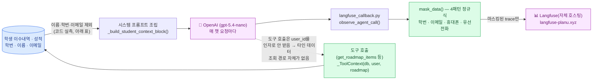

# AI 활용 내역

Plan-U 개발 과정에서 활용한 AI 도구, 활용 범위, AI가 생성한 코드의 검증·수정 방식을 정리한다.

## 1. 활용한 AI 도구

| 도구 | 성격 | 용도 |
|---|---|---|
| **Claude Code**(Anthropic, Claude Max 요금제) | AI 페어 프로그래밍 에이전트 | 팀 전체의 주력 개발 도구. 백엔드/프론트엔드/데이터 파이프라인/문서를 실제 파일시스템·터미널·DB에 직접 접근해 작업. Max 구독료는 팀 공동 경비로 부담 |
| **Cursor**(Anysphere) | AI 코드 에디터 | 프론트엔드 화면 작업처럼 인라인 diff를 보면서 빠르게 반복하는 작업에 병행 사용. Claude Code/Codex처럼 별도 API 키가 아니라 자체 구독으로, 이 역시 팀 공동 경비 |
| **Codex**(OpenAI) | AI 페어 프로그래밍 에이전트 | 팀원 간 작업 분담 시 병행 사용(예: 학과별 교육과정 원문 수집처럼 병렬화 가능한 조사 작업을 도구별로 나눠 진행) |
| **Figma MCP** | 디자인 연동(MCP 서버) | AI 에이전트가 Figma 파일의 변수·컴포넌트 스펙을 API로 직접 조회해서 디자인 토큰(색상·간격 등)을 코드에 반영. 사람이 값을 눈으로 보고 옮겨 적는 것보다 오차가 적음 |
| **Notion MCP** | 협업 문서 연동(MCP 서버) | 팀 기획·회의록이 Notion에 있어서, AI 에이전트가 그 문서를 직접 조회해 요구사항·결정사항을 코드/문서 작업에 바로 반영 |
| **gpt-5.4-nano**(OpenAI) | **제품 런타임 기능** | 로드맵·시간표 AI 상담 에이전트의 실제 응답 생성 모델. 골든 데이터셋(N=3) 벤치마크로 gpt-4o-mini 대비 정답률 +24%p, 지연시간 -30%를 확인하고 채택 |
| **text-embedding-3-small**(OpenAI) | 제품 런타임 기능 | 졸업요건·교육과정 문서 RAG 검색용 임베딩 |

Claude Code/Cursor/Codex/Figma MCP/Notion MCP는 **개발 과정의 도구**이고, gpt-5.4-nano/text-embedding-3-small은 **서비스 자체에 내장된 기능**이라는 점을 구분한다. 아래 2·3절은 전자(개발 도구로서의 AI 활용)를 기준으로 서술한다.

### 왜 이 조합을 선택했는지

**개발 도구(Claude Code/Cursor/Codex)**
- 파일시스템·터미널·DB에 직접 접근하는 에이전트가 필요했다. 5인 팀이 짧은 기간에 크롤러 재실행, 카탈로그 갭 데이터 보정, DB 직접 조회 같은 반복적인 데이터 정합성 작업을 병행해야 했는데, 코드만 제안하고 실행은 사람이 하는 어시스턴트로는 이 규모의 반복 작업을 감당하기 어려웠다.
- 세 도구를 병행한 이유는 단일 도구 장애/한도에 팀 전체 진행이 막히지 않게 하기 위해서다 — 학과별 교육과정 원문 수집처럼 서로 독립적으로 병렬화 가능한 조사 작업을 도구별로 나눠 진행했고, 프론트엔드처럼 눈으로 diff를 확인하며 빠르게 반복하는 작업엔 Cursor를, 터미널·DB·다중 파일을 넘나드는 백엔드/데이터 작업엔 Claude Code를 주로 썼다.
- Claude Max·Cursor 구독료는 팀원 개인이 아니라 **공동 경비**로 처리했다 — 특정 팀원만 AI 도구를 못 쓰는 상황을 만들지 않고, 누구든 막히면 바로 AI 에이전트를 켤 수 있게 하려는 목적이었다.

**MCP 연동(Figma / Notion)**
- 디자인-개발 핸드오프에서 반복됐던 문제는 "시안과 실제 컴포넌트가 안 맞는다"였다(6번 참고). Figma MCP로 AI 에이전트가 디자인 토큰 값을 파일에서 직접 읽어오게 하면서, 사람이 눈대중으로 옮겨 적다가 생기는 오차를 줄였다.
- 팀 회의록·기획 결정이 Notion에 쌓이는데, 그걸 매번 사람이 다시 정리해서 AI에게 프롬프트로 넣는 대신 Notion MCP로 AI가 직접 조회하게 해서 컨텍스트 전달 비용을 줄였다.

**제품 런타임(gpt-5.4-nano / text-embedding-3-small)**
- gpt-5.4-nano는 추정이 아니라 **골든 데이터셋(N=3) 벤치마크로 실측**하고 골랐다:

  | 모델 | 정답률 | 지연시간 |
  |---|---|---|
  | gpt-4o-mini(기존) | 기준 | 기준 |
  | **gpt-5.4-nano(채택)** | **+24%p** | **-30%** |

  로드맵·시간표 상담처럼 매 턴 도구 호출을 여러 번 거치는 구조에서는 지연시간이 누적되므로, 정답률과 지연시간을 동시에 개선한 쪽을 택했다.
- text-embedding-3-small은 임베딩 대상이 교육과정 카탈로그 문서(수천 건 규모, §4 참고)로 크기가 제한적이라 대형 임베딩 모델의 성능 이점이 크지 않다고 보고, 비용·지연시간이 작은 소형 모델을 채택했다. 채팅 모델과 같은 프로바이더(OpenAI)를 써서 API 키·요금제·장애 대응 창구를 하나로 유지하는 것도 팀 규모에서 관리 부담을 줄이는 실질적 이유였다.

## 2. 활용 범위

- **코드 생성**: FastAPI 라우터, SQLAlchemy 모델, Alembic 마이그레이션, React/TypeScript 프론트엔드, pytest 테스트 코드 전반.
- **데이터 파이프라인**: 수강편람·졸업요건 원문(One-Stop 포털, 학과 홈페이지 HWP/PDF/AIS 위젯 등)을 수집하는 크롤러(Playwright 기반), 파서, 정규화 스크립트.
- **디자인 연동(Figma MCP)**: Figma 파일의 색상·간격·타이포그래피 변수를 AI 에이전트가 API로 직접 조회해 CSS/디자인 토큰과 대조. 다만 MCP로 가져온 값도 그대로 믿지 않고 실제 렌더링된 화면과 다시 맞춰보는 과정이 매번 필요했다(3절 참고).
- **협업 문서 연동(Notion MCP)**: 팀 회의록·기획 결정이 쌓이는 Notion 워크스페이스를 AI 에이전트가 직접 조회해서, 사람이 매번 요약해 옮기지 않아도 최신 결정사항을 코드/문서 작업에 반영.
- **문서화**: README, `docs/CHANGELOG.md`, 기능 문서(`docs/backend/features/`), PR 설명, 이 문서를 포함한 제출 문서.
- **디버깅/장애 대응**: 배포 후 회귀(예: 마이그레이션 누락으로 인한 회원가입 실패)를 실시간으로 진단하고 복구.
- **코드 리뷰**: 아래 3절 참고.

**규모 참고**(2026-08-24 기준, 저장소 생성일 2026-05-21로부터 약 3개월): 병합된 PR 230개, `main` 커밋 222개, Alembic 마이그레이션 48개, 백엔드 단위 테스트 656개. 5인 팀·해커톤 일정 안에서 이 규모의 변경을 각자 개발과 병행 리뷰까지 거치며 감당할 수 있었던 건, AI 에이전트가 데이터 정합성 보정이나 반복적인 리팩터링 같은 시간이 많이 드는 작업을 대신 처리해준 부분이 크다.

## 3. AI 생성 코드의 검증·수정 방식

**AI가 작성했다는 사실만으로 신뢰하지 않는다**는 원칙을 프로젝트 규칙(`CLAUDE.md`)에 명문화하고 실제로 지켰다.

1. **판정 로직과 생성 로직을 분리한다.** 졸업요건 충족 여부 같은 사실 판정은 규칙 기반 엔진(`graduation_progress.py`)만 하고, LLM은 그 결과를 받아 설명·추천 문장만 만든다. AI가 직접 "졸업 가능 여부"를 판단하지 않도록 아키텍처 단계에서 경계를 그었다.
2. **골든 테스트로 판정 로직 회귀를 고정한다.** 실제 학과 데이터를 근거로 한 시나리오(TC01~TC09)를 `tests/run_golden_tests.py`로 관리하고, 이 로직을 건드리는 모든 변경은 전체 통과를 확인한 뒤에만 완료로 간주한다.
3. **PR마다 독립 리뷰를 거친다.** 작성자(AI 세션)와 별도의 새 AI 에이전트를 격리된 git worktree에서 띄워, "작성자 주장을 믿지 말고 직접 실행해서 재현하라"는 지시로 재검토시킨다. 이 과정에서 실제 결함이 여러 차례 발견됐다 — 예를 들어 로드맵 다학기 계획 기능에서 존재하지 않는 상태값(`"rejected"`)으로 필터링해 잠재 버그를 심었던 것을 리뷰가 잡아내 수정 후 재리뷰·병합했다. 코드가 리뷰 이후 다시 수정되면 반드시 재리뷰를 거친다.
4. **LLM 프롬프트 변경은 1회 성공을 근거로 삼지 않는다.** 시스템 프롬프트 등 LLM 행동에 영향을 주는 변경은 정적 검증(dry-run)만으로 부족하다는 것을 실제로 겪었다 — 1회 라이브 테스트만 통과시키고 "확인됨"이라 기록했다가 재검증에서 3회 중 3회 실패한 사례가 있어, 이후로는 **동일 시나리오를 최소 3회 반복 실행**해 대다수가 통과할 때만 신뢰한다.
5. **실데이터·실계정으로 직접 확인한다.** 코드를 읽고 "맞을 것"이라고 추정하는 대신, 실제 배포 API에 인증 토큰으로 직접 요청을 보내거나 브라우저 자동화(Playwright)로 화면을 조작해 응답·화면 결과까지 확인한다. 이 방식으로 "머지된 필터 기능이 실제 배포본에는 반영되지 않았다"는 배포 파이프라인 문제도 코드가 아닌 실제 접속 테스트로 발견했다.
6. **되돌리기 어려운 작업은 로컬에서 먼저 검증한다.** DB 마이그레이션·대량 데이터 반영은 팀 공유 Supabase에 바로 적용하지 않고, 로컬 Postgres에서 전체 파이프라인(마이그레이션→시드→골든테스트)을 통과시킨 뒤에만 실 환경에 반영한다.
7. **최종 승인은 사람이 한다.** 모든 변경은 GitHub PR로 올라가며(브랜치 보호 규칙으로 `main` 직접 푸시가 차단됨), 팀원이 PR을 확인하고 병합 여부를 결정한다. AI 세션은 코드 작성·자체 검증·독립 리뷰까지 수행하되, 저장소에 대한 최종 결정권은 갖지 않는다.
8. **MCP로 가져온 외부 데이터도 검증 대상이다.** Figma MCP로 조회한 디자인 토큰 값을 그대로 코드에 넣고 끝낸 적이 없다 — 실제로 반영한 화면을 다시 스크린샷/렌더링해서 시안과 비교하는 라운드를 매번 거쳤다(Figma 시안이 실제 화면에 세 번에 걸쳐 재정합된 사례가 있다, README 7절 참고). MCP가 최신 값을 정확히 가져왔다는 것과 그 값이 실제로 올바르게 적용됐다는 것은 서로 다른 확인이라는 걸 반복해서 확인했다.
9. **도구를 하나만 믿지 않는다.** Claude Code·Cursor·Codex를 한 사람이 동시에 여러 개 켜두고 작업을 병렬로 맡기다 보니, 같은 유형의 버그(예: 상태값 오탐, 조건문 부호 반대)가 도구를 바꿔도 반복되는지, 아니면 특정 도구/모델에서만 나오는지 자연스럽게 비교가 됐다. 도구가 늘어난다고 검증 부담이 줄어드는 게 아니라, 오히려 "이 결과가 도구의 습관적 실수인지 실제 요구사항 이해 문제인지"를 구분하는 데 도움이 됐다.

## 4. 보안 — 개인정보가 외부로 어떻게 (안) 나가는가

제품 런타임(§1)이 학생 개인정보를 다루는 챗 기능에 LLM을 쓰는 만큼, "무엇을 외부로 보내고 무엇을 막는가"를 코드 실측 기준으로 고정해뒀다. 상세 근거는 `docs/backend/features/llm-privacy-audit.md`.

### 외부로 나가는 경로는 두 개뿐이다

### LLM 프롬프트에 보내는 것 / 안 보내는 것

| 보낸다 (학사 판단에 필수) | 안 보낸다 (코드로 확인) |
|---|---|
| 학과명·전공명·program_type·교육과정연도 | 이름(`users.name`) |
| 진로 목표(자유 입력 필드) | 학번(`users.student_id`) |
| 이수기록(과목명 + 이수구분, 성적 등급 제외) | 이메일 |
| 균형교양 세부영역별 이수 요약 | One-Stop 포털 비밀번호(애초에 저장 안 함) |
| 도구 응답(남은 학점·로드맵 항목·검색 결과) | `user_id`는 내부 PK만, 필드명을 `student_id`로 두지 않아 LLM이 학번으로 오인해 답변에 노출하는 것도 차단 |

원칙은 "학생을 특정할 수 있는 직접 식별자는 프롬프트에 넣지 않는다" — 학과·과목·학점 같은 quasi-identifier는 기능상 필수라 보내되, 그 자체로는 개인을 특정하지 못한다.

### 도구 호출 구조 자체가 타인 데이터 조회를 막는다

로드맵/시간표 에이전트가 호출하는 모든 도구는 `_ToolContext(db, user, roadmap)`에 요청 시작 시점에 바인딩된 `user`만 참조하고, **`user_id`를 LLM이 넘기는 인자로 받지 않는다.** 즉 프롬프트 인젝션으로 "다른 학번의 정보를 보여줘"라고 유도해도, 애초에 그런 값을 전달할 경로가 도구 시그니처에 없다. 이 성질을 깨는 변경(도구에 `user_id` 파라미터 추가)은 PR 체크리스트에서 금지 항목으로 명시돼 있다.

### Langfuse 마스킹 4패턴

관측 도구(Langfuse)로 나가는 trace에는 LLM 호출과 별개로 아래 4패턴이 재귀 적용된다(원본 LLM 호출에는 영향 없음 — trace 페이로드만 치환):

| 패턴 | 대상 | 치환 |
|---|---|---|
| 학번 | `(19\|20)\d{2}` 연도 앵커 + 4~6자리 | `<STUDENT_ID>` |
| 이메일 | 표준 `local@domain` | `<EMAIL>` |
| 휴대전화 | `01X-XXXX-XXXX` | `<PHONE>` |
| 유선전화 | `02`/`031~064` 대역 | `<PHONE>` |

`user_id`는 원문 대신 `salt+sha256` 해시 앞 12자만 전송한다.

### 알려진 한계 (숨기지 않고 명시)

- 마스킹은 Langfuse trace에만 적용된다 — LLM 프로바이더로 가는 원본 프롬프트에는 애초에 식별자를 안 넣는 것(위 표)이 1차 방어선이고, 마스킹은 사용자가 채팅창에 직접 학번을 입력하는 경우를 잡는 2차 방어선이다.
- `career_goal`·채팅 메시지 같은 자유 입력 필드는 4패턴에 안 걸리는 식별정보(주소·생년월일 등)가 통과할 수 있다.
- 계정 탈퇴는 DB만 지운다 — Langfuse에 남은 해시 user_id trace는 별도 삭제 절차가 필요하다.
- Langfuse를 자체 호스팅(`langfuse-planu.xyz`)으로 운영하면서 접근 통제 책임이 벤더(Cloud seat 제한)에서 팀 자신(이 호스트의 로그인·TLS·방화벽 설정)으로 넘어왔다 — 계정 발급은 인스턴스 소유자가 팀원을 개별적으로 admin 권한으로 초대하는 방식으로 운영 중이라고 확인받았다(2026-08-24). 불특정 다수가 자유롭게 가입하는 구조는 아니지만, 이 확인은 소유자 진술에 의존하며 코드·API로 독립 검증한 것은 아니다.
